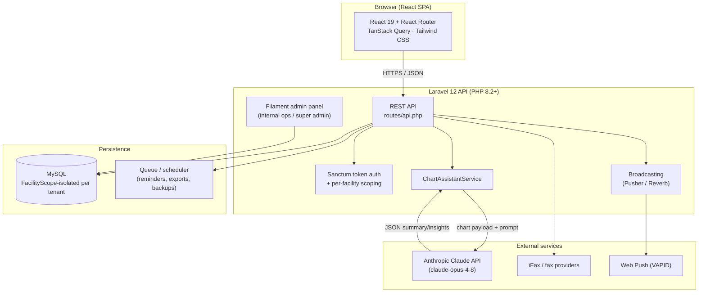

# HomeLogic360

**AI-powered care management for Adult Family Homes (AFH) and small assisted-living facilities.**

HomeLogic360 replaces the paper binders, spreadsheets, and sticky-note handoffs that small care facilities run on with a single system — and adds a Claude-powered assistant that reads a resident's chart and tells staff what actually needs attention, instead of making them dig through it themselves.

---

## The problem

Adult Family Homes and small residential care facilities sit in an awkward gap: too small and cash-strapped to license enterprise EHR platforms built for hospital systems, but still legally required to track the same things — vital signs, medication administration, sleep, behavior incidents, appointments, staff certifications, incident reports — with the same audit-readiness expectations.

The result, in practice:

- Paper charts and spreadsheets that don't talk to each other
- Missed medication doses that go unnoticed until a shift-change review
- No fast way to answer "is this resident okay, and if not, why?" without manually re-reading days of vitals, sleep, and behavior logs
- Owner-operators acting as admin, scheduler, biller, and compliance officer with no software built for that reality

## The solution

HomeLogic360 is a multi-tenant web application: one deployment serves many independent facilities, each with its own residents, staff, branches, branding, and data — fully isolated from every other facility on the platform.

Every operational area a small care facility needs is built in as one connected system instead of a patchwork of tools:

| Area | What it covers |
|---|---|
| **Residents** | Profiles, admission/discharge lifecycle, room assignment, sign-out/sign-in tracking |
| **Clinical** | Vital signs (with configurable normal/warning/critical ranges), medication orders + administration (MAR), sleep pattern tracking, behavior charting, assessments |
| **Operations** | Housekeeping tasks by area/shift, grocery status tracking, fire drills, incident reporting |
| **Management** | Pharmacy inventory + stock lots + suppliers + deliveries, billing/expense categories, visitor check-in, document library, fax (inbound/outbound, iFax integration) |
| **Team & compliance** | Staff clock-in/out, leave requests, employee documents, role/permission management |
| **AI Assistant** | Claude-powered chart analysis — ask a plain-language question about a resident and get a grounded answer, not a canned template |

### The AI Assistant

This is the feature that sets HomeLogic360 apart from a typical CRUD admin panel. Instead of forcing a caregiver to manually cross-reference vitals, medications, sleep, and behavior charts to answer a question like *"is this resident in decline?"*, the AI Assistant:

1. Assembles a structured payload of the resident's recent chart data (vitals, medication adherence, sleep, behavior events, upcoming appointments, recent faxes) for a selectable time window
2. Sends it to **Claude (Opus 4.8)** via the Anthropic API with the caregiver's actual question
3. Returns a direct, evidence-based answer plus supporting insights and recommendations — not a restatement of raw numbers

It also ships with a deterministic **heuristic fallback** (plain PHP logic, no AI involved) that keeps the feature usable if the Anthropic API is temporarily unavailable — the UI always shows which mode produced the answer (`Mode: anthropic` vs `Mode: heuristic`) so staff can tell the difference.

Source: [`app/Services/ChartAssistantService.php`](app/Services/ChartAssistantService.php) · [`resources/js/components/reports/ChartAssistantPanel.jsx`](resources/js/components/reports/ChartAssistantPanel.jsx)

---

## Architecture



**Multi-tenancy**: every tenant-scoped Eloquent model is protected by a global `FacilityScope` that automatically filters queries to the authenticated user's facility (and branch, for branch-level roles), with `super_admin` bypassing the scope entirely to manage the platform across all facilities. This means a single codebase and database serve every facility, with data isolation enforced at the query layer rather than by spinning up separate deployments.

**Frontend**: a single-page React application (not Inertia) that talks to the Laravel backend purely over a JSON REST API, authenticated with Laravel Sanctum tokens. Real-time UI updates (new notifications, vital sign alerts, fax status) are pushed over WebSockets via Pusher (or self-hosted Laravel Reverb as a drop-in alternative).

**Admin panel**: [Filament](https://filamentphp.com/) provides the internal/back-office views (facility management, permissions, catalog data) alongside the caregiver-facing React SPA.

---

## Tech stack

| Layer | Technology |
|---|---|
| Backend | Laravel 12, PHP 8.2+ |
| Auth | Laravel Sanctum (API tokens) |
| Admin panel | Filament 3 |
| Database | MySQL (SQLite supported for local dev) |
| Frontend | React 19, React Router 7, TanStack Query 5, Tailwind CSS 4, Vite 7 |
| Real-time | Pusher Channels / Laravel Reverb, Laravel Echo |
| AI | Anthropic Claude API (`claude-opus-4-8`) |
| Billing | Laravel Cashier (Stripe) |
| PDF/exports | barryvdh/laravel-dompdf, spatie/browsershot |
| Push notifications | Web Push (VAPID) |

---

## Getting started

### Prerequisites

- PHP 8.2+
- Composer
- Node.js 18+ and npm
- MySQL (or SQLite for a quick local setup)

### Setup

```bash
git clone <this-repo>
cd HomeLogic360

# Backend dependencies
composer install

# Environment
cp .env.example .env
php artisan key:generate

# Edit .env: set DB_* to your database, and (for the AI Assistant) add:
#   ANTHROPIC_API_KEY=sk-ant-...
# See "Environment variables" below for the full list.

# Database
php artisan migrate --force
php artisan db:seed --force

# Frontend
npm install
npm run build

# Storage symlink (facility logos, documents)
php artisan storage:link

php artisan serve
```

Or use the built-in dev script, which runs the server, queue listener, log tailer, and Vite dev server together:

```bash
composer run dev
```

### Seeded accounts

The default seeders create a demo facility ("Edmond Serenity AFH") with an administrator account and a super admin account. **Change these passwords immediately in any non-local environment.** See `database/seeders/UnifiedProductionSeeder.php` and `database/seeders/SuperAdminSeeder.php` for the exact seeded credentials.

### Environment variables

Beyond the standard Laravel `.env` values, HomeLogic360 uses:

| Variable | Purpose |
|---|---|
| `ANTHROPIC_API_KEY` | Required for the AI Assistant to call Claude; without it the assistant runs in heuristic-only mode |
| `BROADCAST_CONNECTION` + `PUSHER_*` | Real-time notifications, vital alerts, fax status updates |
| `AUTO_LOGIN_EMAIL` | Optional — bypasses the login screen for a specific account (used for demo/grading access; see note below) |
| `VAPID_*` | Web push notifications (PWA) |
| `FAX_IFAX_WEBHOOK_SECRET` | iFax webhook verification (fax provider credentials are stored per-facility in the database, not `.env`) |
| `AWS_*` | Optional S3/SES integration |

See [`.env.example`](.env.example) for the complete, commented list.

> **Note for reviewers**: this deployment currently auto-authenticates visitors and lands directly on the AI Assistant page, bypassing the login screen, to make grading/demo access frictionless. This is a temporary configuration for evaluation purposes — the underlying login, role, and permission system is fully implemented and enforced everywhere else (see `app/Http/Controllers/Api/AuthController.php` and `app/Models/Scopes/FacilityScope.php`).

---

## Project structure

```
app/
  Http/Controllers/Api/     REST API controllers (residents, medications, vitals, chart assistant, ...)
  Models/                   Eloquent models + FacilityScope multi-tenant isolation
  Observers/                Model event side-effects (notifications, broadcasts, inventory deduction)
  Services/                 Business logic (ChartAssistantService, NotificationService, ...)
  Filament/Resources/       Admin-panel CRUD resources
database/
  migrations/               Schema
  seeders/                  Demo data (residents, vitals, medications, pharmacy, fax, ...)
resources/js/
  pages/                    Route-level React components
  components/               Shared UI (Layout, ChartAssistantPanel, ...)
  services/api.js           Axios client + auth token handling
routes/
  api.php                   API route definitions
```

---

## License

This project was built as a personal/portfolio project by Gibril Lowe, founder of USGamNeeds.
